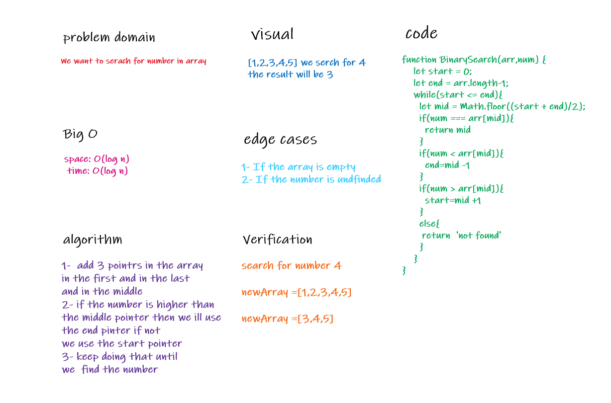

# Link To Code !

[Binary Array code ](https://github.com/IbrahimAljabr/data-structures-and-algorithms/blob/master/javascript/code-challenges/arrayShift/array-shift.js)

# Challenge Summary

- search for number in an array using binary search . 

## Challenge Description
- searching in less time for hugh data

## Approach & Efficiency
- to make it less complex as possible .
- space: O(log n)
- time: O(log n)

## Solution

