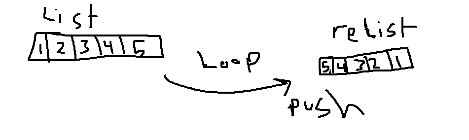

# Reverse an Array
<!-- Short summary or background information -->
- take array and re pushed in another array
## Challenge
<!-- Description of the challenge -->
- how to do it first time 
## Approach & Efficiency
<!-- What approach did you take? Why? What is the Big O space/time for this approach? -->
- no big O yet 
## Solution
<!-- Embedded whiteboard image -->

