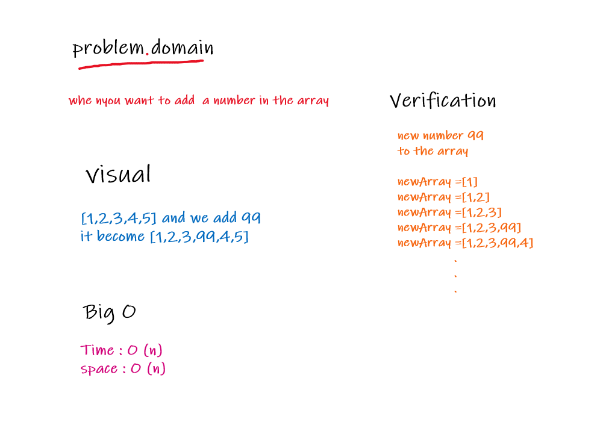

# Link To Code !

[Shift Array code ](https://github.com/IbrahimAljabr/data-structures-and-algorithms/blob/master/javascript/code-challenges/arrayShift/array-shift.js)

# Challenge Summary

- Add a value in the middle of an array.

## Challenge Description
- find the middle of the array to add the new value to it.

## Approach & Efficiency
- to make it less complex as possible .

## Solution

