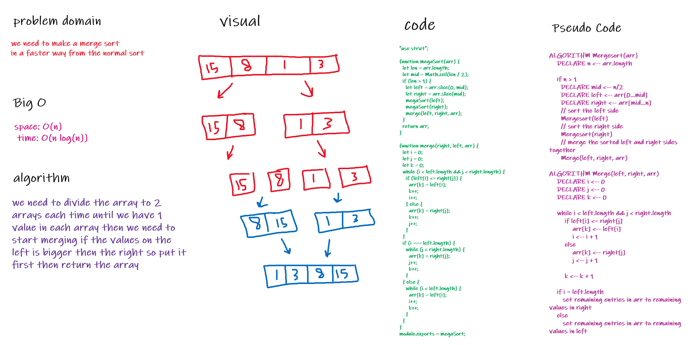

# Challenge Summary

- Merge Sort is a Divide and Conquer algorithm. It divides the input array into two halves then  merging two halves

## Challenge Description

- merge sort array to do it in less time

## Approach & Efficiency

- to make it less complex as possible .
- space: O(n)
- time: O(log n)

## Solution

