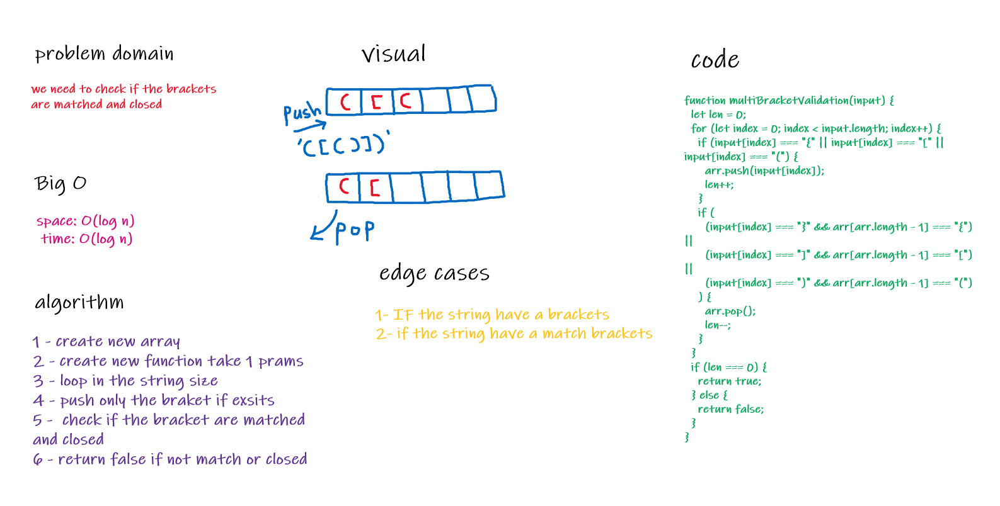

# Link To Code !

[Queue using two Stacks ](https://github.com/IbrahimAljabr/data-structures-and-algorithms/blob/master/javascript/code-challenges/queueWithStacks/queue-with-stacks.js)

# Challenge Summary

- adding multi brackets
- adding words in the string

## Challenge Description

- Searching in the sting for brackets and find if they are matching or closed.

## Approach & Efficiency

- to make it less complex as possible .
- space: O(log n)
- time: O(log n)

## Solution

