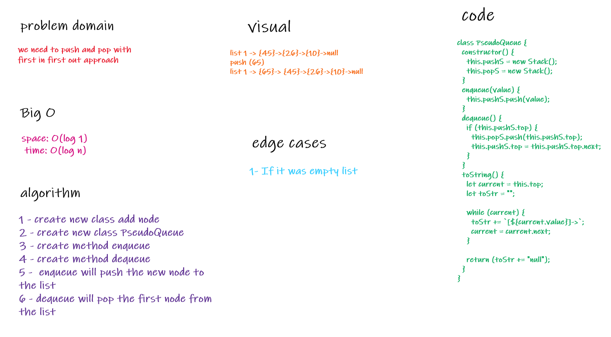

# Link To Code !

[Queue using two Stacks ](https://github.com/IbrahimAljabr/data-structures-and-algorithms/blob/master/javascript/code-challenges/arrayBinarySearch/array-binary-search.js)

# Challenge Summary

- push in the end of the stack.
- pop from the first.

## Challenge Description

- Queue in less time for hugh data

## Approach & Efficiency

- to make it less complex as possible .
- space: O(log 1)
- time: O(log n)

## Solution

