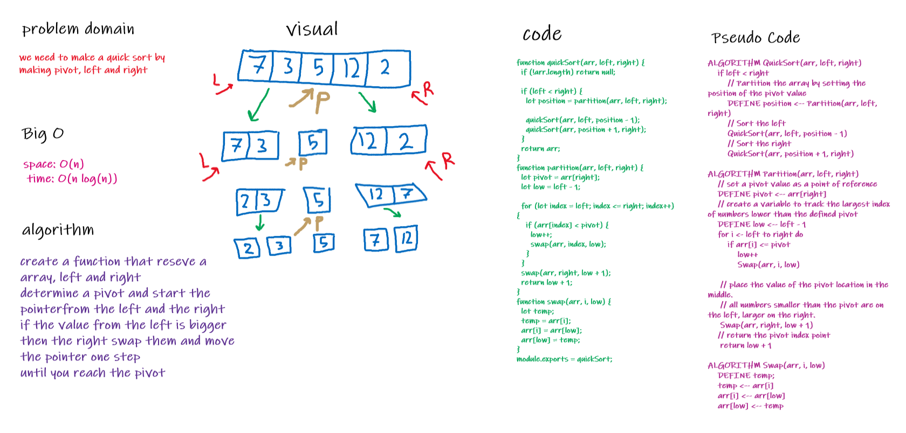

# Challenge Summary

- Quicksort is a divide-and-conquer algorithm. It works by selecting a 'pivot' element from the array and partitioning the other elements into two sub-arrays

## Challenge Description

- convert Pseudo Code to a working code 

## Approach & Efficiency

- to make it less complex as possible .
- space: O(n)
- time: O(log n)

## Solution

