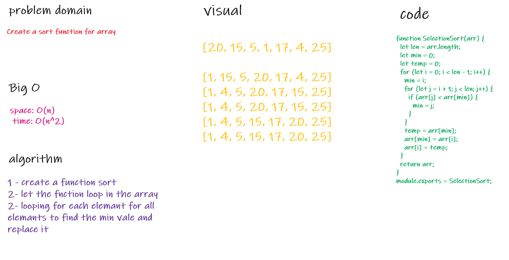

# Challenge Summary

- Sorting in array 

## Challenge Description

- Queue in less time for hugh data

## Approach & Efficiency

- to make it less complex as possible .
- space: O(log n)
- time: O(log n^2)

## Solution

