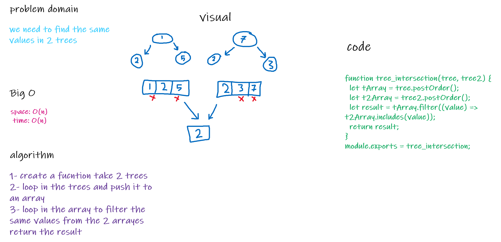

# Challenge Summary

- find the same values from 2 trees

## Challenge Description

- sort the trees and loop in the arrays to find the values

## Approach & Efficiency

- to make it less complex as possible .
- space: O(n)
- time: O(n)

## Solution

