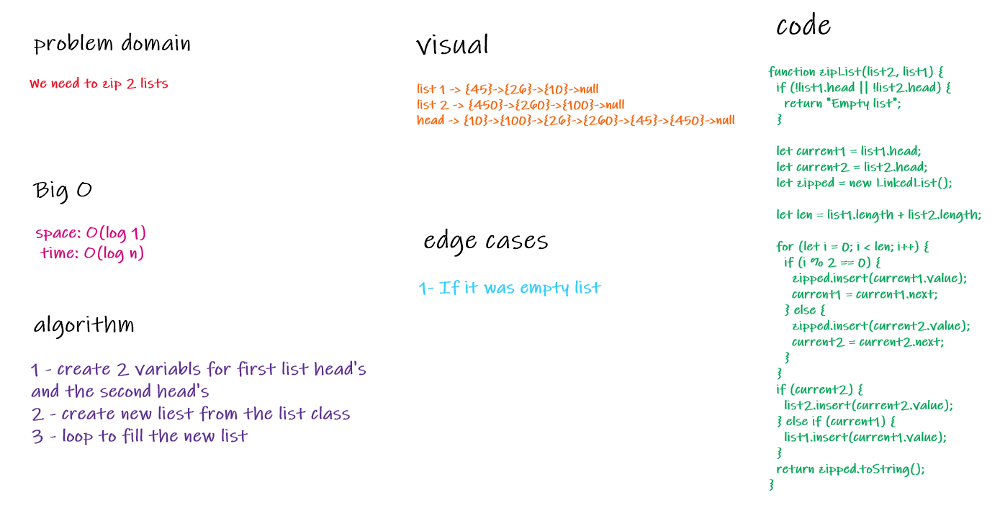

# Link To Code !

[Linked-list ](https://github.com/IbrahimAljabr/data-structures-and-algorithms/blob/master/javascript/linkedList/linked-list.js)

# Singly Linked List

- zip 2 linked lists .

## Challenge

- checking if the list is empty.
- looping in the list

## Approach & Efficiency

- to make it less complex as possible .
- space: O(log 1)
- time: O(log n)

## API

- insert() to add value to the list.
- includes() to search in the list for value if exists.
- toString() return the list in string
- append() to add to the end.
- insertAfter() to add after the selected node.
- insertBefore() to add before the selected node.
- kthFromEnd() to get the value from the back
- zipList() to zip 2 list

### whiteboard

